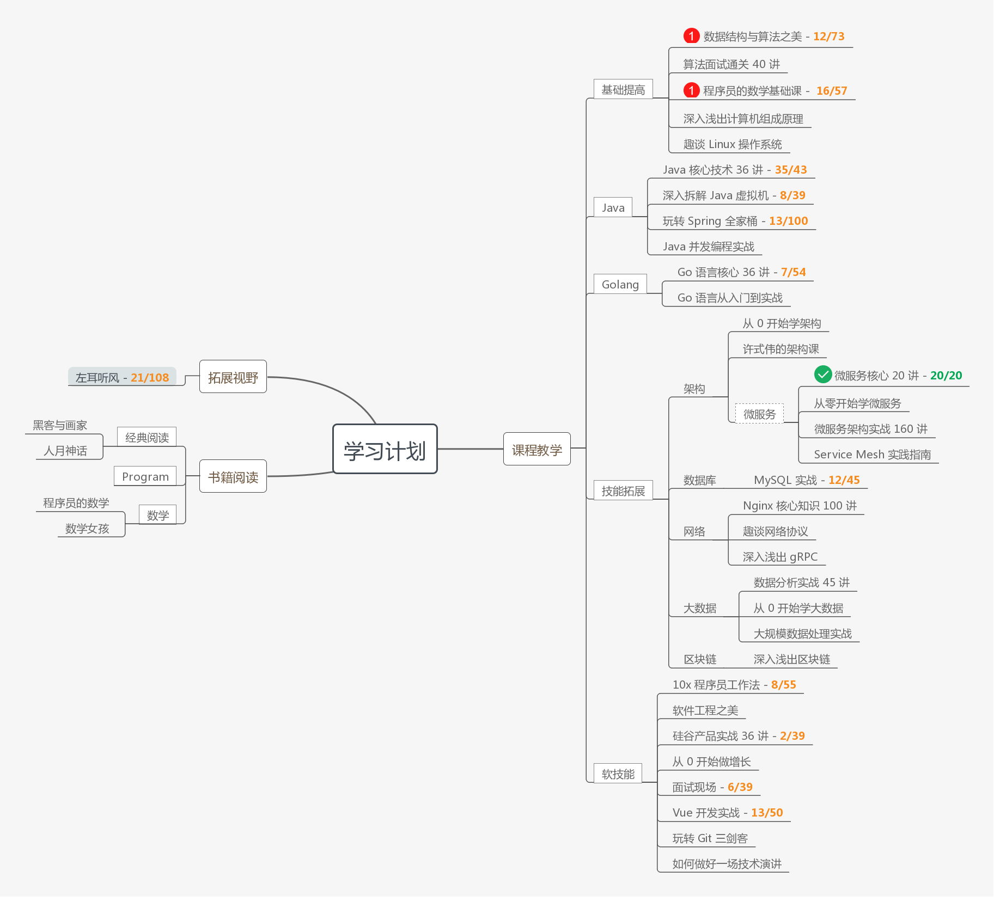
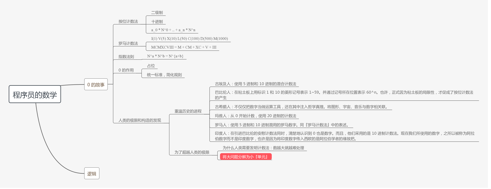

`start again` 重新出发

## 关于本项目

过去在工作中只忙于手边工作，自我驱动学习不足，技能深度不足导致处理问题时疲惫不堪。因此，准备重新出发，利用业余时间补充能量。

本项目将记录我的学习计划和进度，每一种技能或书籍的笔记、代码产出会单独建立一个项目，在本项目对应的条目会附上链接。

## 学习计划

### 书籍

- [ ] [图解设计模式](https://github.com/N0nb0at/design-pattern)
  - [第一章：Iterator 模式](https://github.com/N0nb0at/design-pattern/tree/dev/src/main/java/cn/n0nb0at/designpattern/chapter_01_iterator)
  - [第二章：Adapter 模式](https://github.com/N0nb0at/design-pattern/tree/dev/src/main/java/cn/n0nb0at/designpattern/chapter_02_adapter)
  - [第三章：Template Method 模式](https://github.com/N0nb0at/design-pattern/tree/dev/src/main/java/cn/n0nb0at/designpattern/chapter_03_template_method)
  - [第四章：Factory Method 模式](https://github.com/N0nb0at/design-pattern/tree/dev/src/main/java/cn/n0nb0at/designpattern/chapter_04_factory_method)

- [ ] Java 8 in Action
- [ ] 图解 Java 并发编程
- [ ] 程序员的数学 
- [ ] [黑客与画家](https://github.com/N0nb0at/N0nb0at.github.io/blob/dev/source/_posts/HackersAndPainters.md)
